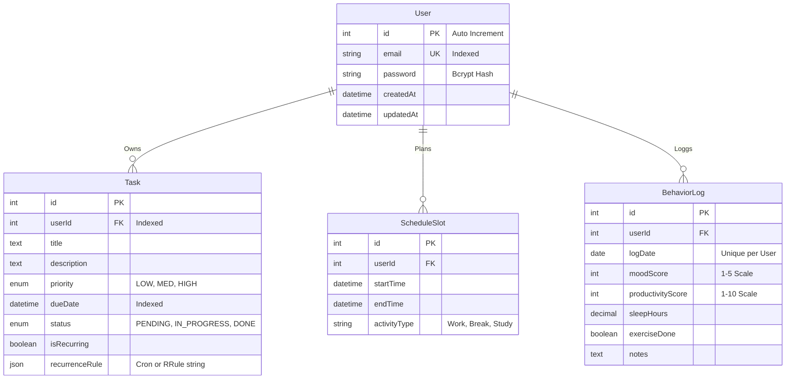

# 🗄️ Database Design Specification

**Version:** 1.0  
**Engine:** PostgreSQL 16+  
**ORM:** Prisma Client

---

## 1. Schema Diagram (ERD)
The entity relationships follow a star schema where `User` is the central node.

---

## 2. Table Definitions

### 👥 Table: `User`
Stores core identity.
| Column | Type | Constraints | Description |
|--------|------|-------------|-------------|
| `id` | `Int` | `PK`, `Serial` | Unique Identifier |
| `email` | `String(255)` | `Unique`, `Not Null` | Login handle. **Index: `idx_user_email`** |
| `password` | `String` | `Not Null` | Hashed credential |
| `createdAt`| `DateTime` | `Default(NOW())` | Audit timestamp |

### ✅ Table: `Task`
Core work units.
| Column | Type | Constraints | Description |
|--------|------|-------------|-------------|
| `id` | `Int` | `PK`, `Serial` | Unique Task ID |
| `userId` | `Int` | `FK(User.id)` | Owner. **Index: `idx_task_user`** |
| `title` | `String` | `Not Null` | Short description |
| `priority` | `Enum` | `Default('MED')` | Importance level |
| `dueDate` | `DateTime` | `Nullable` | Deadline. **Index: `idx_task_due`** (For cron jobs) |

### 🧠 Table: `BehaviorLog`
Daily analytical data points.
- **Uniqueness Constraint:** `Unique(userId, logDate)` prevents duplicate entries for the same day.

---

## 3. Performance Considerations
1.  **Compound Indexes:**
    -   `Task(userId, status)`: Optimization for "Dashboard" queries.
    -   `Task(status, dueDate)`: Optimization for "Overdue Task" cron jobs.
2.  **Partitioning (Future):**
    -   `BehaviorLog` may be partitioned by `Year` if dataset grows > 10M rows.
